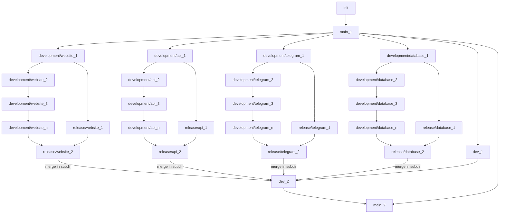

#git
# Git branch magic

```mermaid
graph TD
init --> main_1

main_1 --> dev_1

main_1 --> development/api_1
main_1 --> development/telegram_1
main_1 --> development/database_1
main_1 --> development/website_1

development/website_1 --> development/website_2
development/website_2 --> development/website_3
development/website_3 --> development/website_n

development/telegram_1 --> development/telegram_2
development/telegram_2 --> development/telegram_3
development/telegram_3 --> development/telegram_n

development/api_1 --> development/api_2
development/api_2 --> development/api_3
development/api_3 --> development/api_n

development/database_1 --> development/database_2
development/database_2 --> development/database_3
development/database_3 --> development/database_n

development/api_1 --> release/api_1
development/telegram_1 --> release/telegram_1
development/database_1 --> release/database_1
development/website_1 --> release/website_1

development/api_n --> release/api_2
release/api_1 --> release/api_2

development/telegram_n --> release/telegram_2
release/telegram_1 --> release/telegram_2

development/database_n --> release/database_2
release/database_1 --> release/database_2

development/website_n --> release/website_2
release/website_1 --> release/website_2

release/website_2 -- merge in subdir --> dev_2
release/api_2 -- merge in subdir --> dev_2
release/telegram_2 -- merge in subdir --> dev_2
release/database_2 -- merge in subdir --> dev_2
dev_1 --> dev_2

dev_2 --> main_2
main_1 --> main_2

```